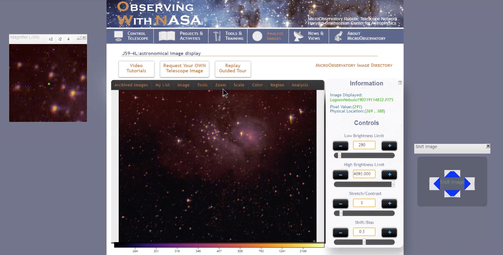
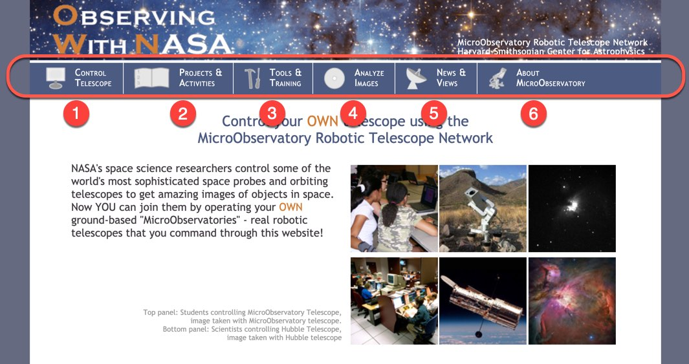
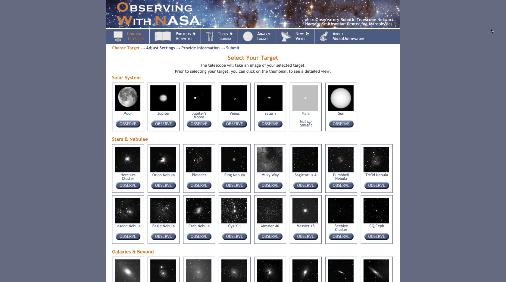
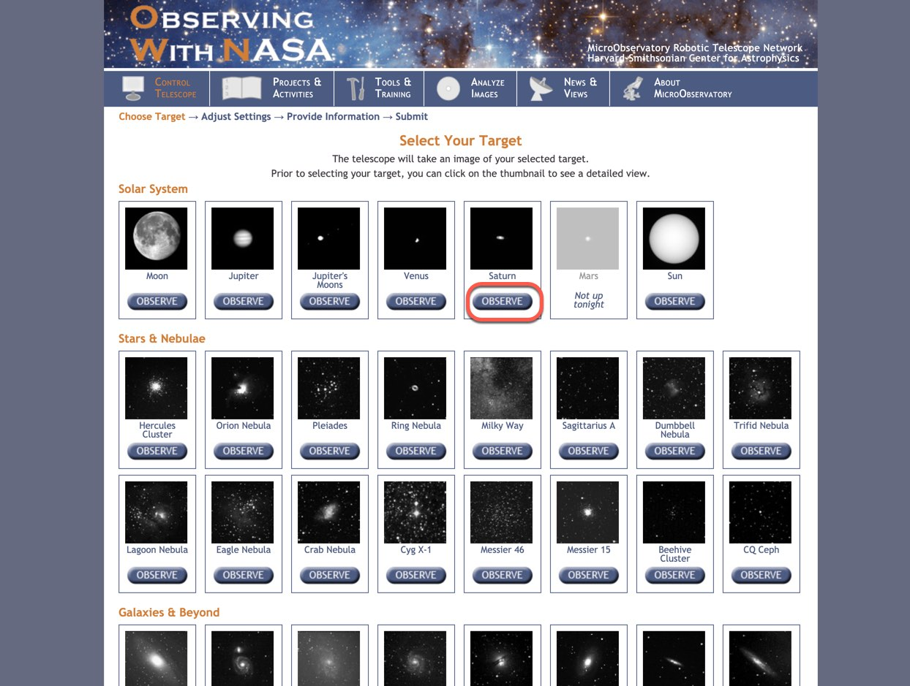
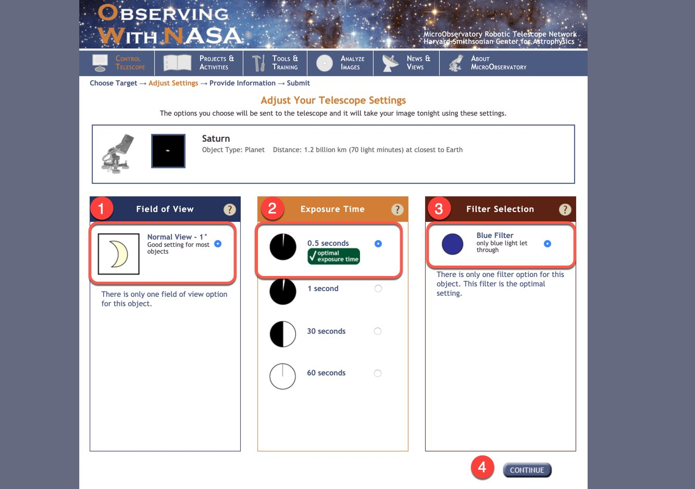
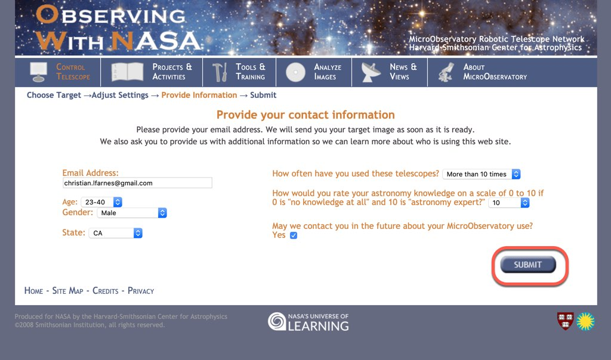

ls# Astrophotography module 1

## Learning the ropes of Microobservatory for astrophotography

In this module we will learn how to schedule a remote telescope to take a photo of celestial bodies and instruct it to send it back to us via email. In later modules we will learn how to edit the images we collected to generate some of the beautiful pictures of space and celestial bodies we often see in magazines or websites:

Yes! you will create similar images, of course, with your own personal touch and learn about astronomy and astrophotography along the way.

## Prerequisites

These are some of the things you will need to follow along and successfully complete the module

- A valid email address that you have access to
- Access to internet

## Getting started

To get started navigate to microobservatory's main webpage:

[https://mo-www.cfa.harvard.edu/MicroObservatory/](https://mo-www.cfa.harvard.edu/MicroObservatory/)

It should look something like this:

Microobservatory is operated by the Harvard-Smithsonian Center for Astrophysics, it is funded and contributed to by NASA and National Science Foundation, feel free to browse the website when you have the time but for now we want to focus on the Observing With Nasa (OWN) service.

Click the link for OWN, it should be on the lower left hand side of the website:

After you click the link it will take you to OWN's main webpage

Take your time to look at the page and read the challenges at the bottom of the page, you might participate in them in the future, there are a lot of places that we can navigate to at the top of the page:

**1\. Control telescope:**

This is the main focus of this first module here you will select your target and set your preferences for taking the picture. In other words you are controlling the remote robotic telescope and telling it how you would like your picture to be taken

**2\. Projects and Activities:**

Here you will find project ideas. For now we wont use this section too much, we need to get pictures first!

**3\. Tools and Training:**

This is where you will learn to use the robotic telescope to it's full potential, pay close attention here we might ask that you read these on your own.

**4\. Analyze Images:**

When we are done taking pictures the next natural step is to edit them to our liking, this section allows us to do just that right on the browser!

**5\. News and Views:**

Contests and activities are announced here, if there is something you are interested in let us know and we might participate!

**6\. About MicroObservatory**

If your interest has been peaked and you want to know everything about how MicroObservatory works visit this page!

## Select your target

Click on section 1 mentioned above **[Control Telescope](https://mo-www.cfa.harvard.edu/cgi-bin/OWN/Own.pl)**.

You will find a page that looks like this:

Here you can choose the objects that interest you the most. Saturn is my favorite planet so I will use it as an example of how to begin taking pictures:

Click on the **Observe** button underneath your target

This will bring you to a page where you can choose the details of how you want to take your photo:

**1\. Field of view**

How "zoomed" in your photograph will be. Note that the measure for this is in degrees, what does this mean? Would a closer picture have more or less degrees?

**2\. Exposure time**

On the robotic telescope there is a camera, the camera has a shutter that is open for a certain amount of time and letting light come into a sensor that saves the picture. The longer the shutter is open the more light comes into the sensor and the more the is recorded onto your photo.

Close your eyes then open and close them as fast as you can, then do it again but leave your eye lids open for one second. When do you see more detail? What differences can you tell?

**3\. Filter selection**

A color filter on a camera will only let certain colors or frequencies of light through. Why would we want to only let some colors through and not others? Take various pictures and change the filter on each picture, note the differences.

Once you are happy with your selection click continue.

## Get your picture in the mail

Fill out the information on the upcoming page, ensure that this is a valid email and that you have access to it, here is a sample of mine:

Finally press submit.

Repeat this process as many times as you would like. The goal is for you to be able to get an image, or set of images, that you can use in future modules.

When you are done, let one of us know and we can instruct you on what you can do next.

## Useful Links

Microobservatory Splash page

`https://mo-www.cfa.harvard.edu/MicroObservatory/`

Main page **O**bserving **W**ith **N**asa

`https://mo-www.cfa.harvard.edu/OWN/`